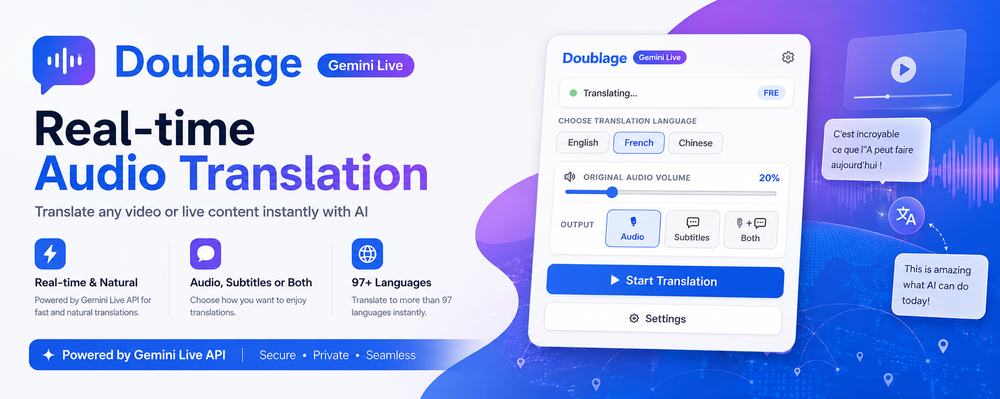
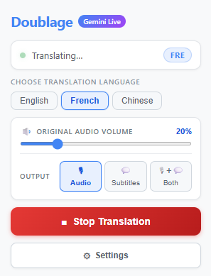
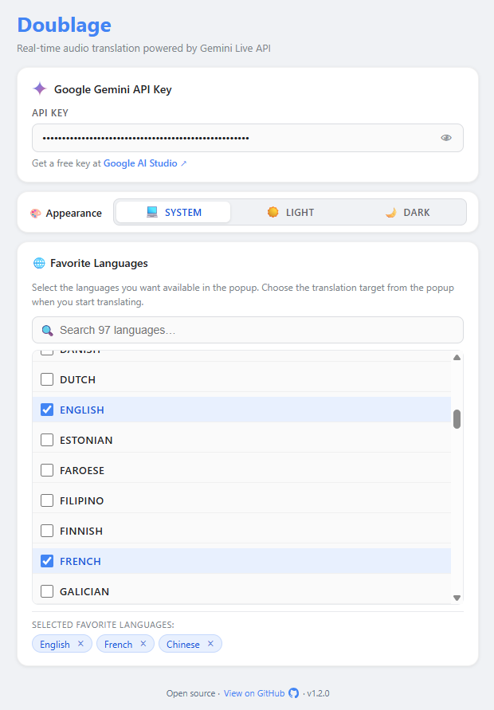

# Doublage

[](https://github.com/Arzaghi/Doublage/releases/latest)
[](https://github.com/Arzaghi/Doublage/actions/workflows/test-gemini.yml)
[](https://github.com/Arzaghi/Doublage/actions/workflows/build-crx.yml)
[](LICENSE)

<p align="center">
   
</p>

**Doublage** is a Manifest V3 Google Chrome extension that translates audio from the
currently active browser tab in real time with the Gemini Live API. It can play
the translated voice, display translated subtitles, and lower or mute the
original tab audio while translation is active.

## Features

- Real-time Google Chrome tab-audio translation using Gemini Live
- Spoken translation, subtitles, or both
- Original-audio controls: duck or mute
- Fast target-language selection and saved user preferences
- Animated toolbar status indicator while translation is active
- No remotely hosted executable code

## Screenshots

<table>
   <thead>
      <tr>
         <th><div align="center">Main Page</div></th>
         <th><div align="center">Settings</div></th>
      </tr>
   </thead>
   <tbody>
      <tr>
         <td valign="top">
            
         </td>
         <td valign="top">
            
         </td>
      </tr>
   </tbody>
</table>

The main popup lets you pick a translation language, adjust the original-audio
volume, choose spoken audio and/or subtitles, and start/stop translation with one
click.

## Requirements

- Google Chrome 116 or later
- A Gemini API key from [Google AI Studio](https://aistudio.google.com/app/apikey)
- A Gemini API key with access to the Gemini Live API

## Local development

1. Clone this repository.
2. Open `chrome://extensions` in Chrome.
3. Enable **Developer mode**.
4. Click **Load unpacked**.
5. Select the [`extension`](./extension) directory — not the repository root.
6. Open **Settings** in the extension and enter your Gemini API key.

After changing extension files, click **Reload** on the extension card in
`chrome://extensions` before testing again.

## Project structure

```text
extension/
  manifest.json                 Extension manifest and version
  background.js                 Manifest V3 service worker
  offscreen.js                  Tab-audio capture, Gemini connection, playback
  audio-capture-worklet.js      AudioWorklet PCM capture processor
  content.js                    Subtitle overlay in the selected tab
  popup.html / popup.js         Main extension interface
  options.html / options.js     Extension settings
  icons/                        Toolbar and extension icons
scripts/
  build.mjs                     Builds the extension package (CRX + ZIP)
dist/                           Build output (CRX, ZIP, version file) — gitignored
package.json                    Node build-tool dependencies
.github/workflows/build-crx.yml Extension build and GitHub Release workflow
screenshots/                    Screenshots used in this README
```

## Privacy and data handling

Translation begins only after the user starts it from the extension popup.
While active, the audio from the selected tab is sent directly to the Gemini
Live API to generate translated audio and/or subtitles. The extension stores
the user’s API key and preferences in Chrome extension storage. It does not
download or execute remotely hosted JavaScript or WebAssembly.

Before publishing, provide an accurate privacy policy and complete the Chrome
Web Store Privacy tab to reflect these practices.

## Building locally

```bash
npm install
npm run build:crx
```

Outputs `Doublage-x.y.z.crx` and `Doublage-x.y.z.zip` in `dist/`.
The CRX requires a private key for create a signed crx (`extension.pem` in the repo root by default).
Set a custom path with the `EXTENSION_KEY_PATH` environment variable:

```bash
# Linux / macOS
EXTENSION_KEY_PATH=/path/to/key.pem npm run build:crx
```

```powershell
# Windows (PowerShell)
$env:EXTENSION_KEY_PATH="C:\path\to\key.pem"; npm run build:crx
```

## Release and Chrome Web Store publishing

Releases are created by pushing a Git tag that matches the version in
[`extension/manifest.json`](./extension/manifest.json).

### Release steps

1. Update the `version` field in `extension/manifest.json`, For example:

   ```json
   "version": "1.3.0"
   ```

2. Commit and push:

   ```bash
   git add extension/manifest.json
   git commit -m "Release v1.3.0"
   git push origin master
   ```

3. Create and push the version tag (tag must match manifest version):

   ```bash
   git tag v1.3.0
   git push origin v1.3.0
   ```

4. GitHub Actions will automatically build and create a GitHub Release with:
   - `Doublage-v1.3.0.crx` : Signed CRX3 package for sideloading/testing
   - `Doublage-v1.3.0.zip` : Plain ZIP for Chrome Web Store upload

5. Download the ZIP from [Releases](../../releases) and upload to the
   [Chrome Web Store Developer Dashboard](https://chrome.google.com/webstore/devconsole).

## Automated Gemini API Integration Test

[`tests/gemini-integration.test.mjs`](./tests/gemini-integration.test.mjs) connects to the real Gemini Live API and verifies the extension's translation pipeline still works: authentication, WebSocket setup, model availability, and the audio-send protocol.

Runs on every push to `master` and **daily at 07:00 UTC** to catch external API changes even when no code has been pushed.

Run the tests locally using a Gemini API key:

```bash
# Linux / macOS
GEMINI_API_KEY=<your-test-key> npm run test:gemini
```

```powershell
# Windows (PowerShell)
$env:GEMINI_API_KEY="<your-test-key>"; npm run test:gemini
```

---

## License

Copyright © 2026 Hamid Reza Arzaghi

Doublage is free software: you can redistribute it and/or modify it under the
terms of the GNU General Public License as published by the Free Software
Foundation, either version 3 of the License, or (at your option) any later
version.

See [LICENSE](./LICENSE) for the full license text.


